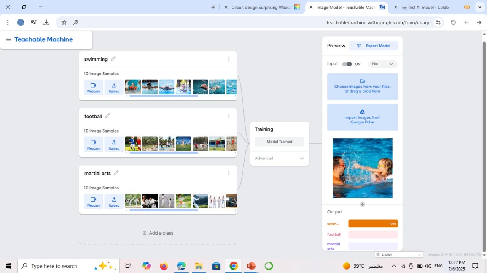
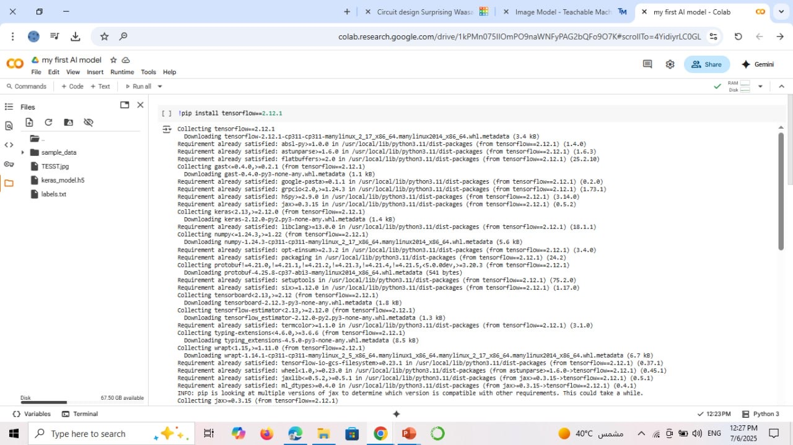
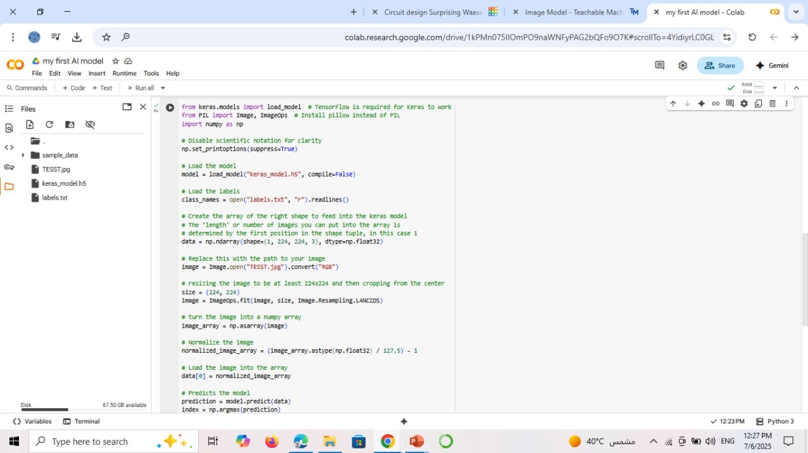
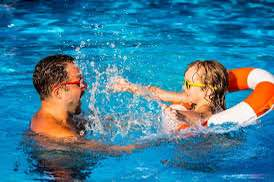

# 🧠 Image Classification Task – Teachable Machine + Google Colab

This project is a simple image classifier trained using Teachable Machine by Google, then deployed and tested using Python in Google Colab.  
It includes training three classes, writing prediction code, and visual documentation.

---

## 📁 Project Files

- keras_model.h5 → Trained model file  
- labels.txt → Class labels file  
- TESST.jpg → Test image used for prediction  
- IMG_5801.jpeg - IMG_5804.jpeg → Screenshots of each step  
- README.md → This file  

---

## 👩‍💻 Python Code & Prediction

```python
from keras.models import load_model  # TensorFlow is required for Keras to work
from PIL import Image, ImageOps  # Install pillow instead of PIL
import numpy as np

# Disable scientific notation for clarity
np.set_printoptions(suppress=True)

# Load the model
model = load_model("keras_model.h5", compile=False)

# Load the labels
class_names = open("labels.txt", "r").readlines()

# Create the array of the right shape to feed into the keras model
# The 'length' or number of images you can put into the array is
# determined by the first position in the shape tuple, in this case 1
data = np.ndarray(shape=(1, 224, 224, 3), dtype=np.float32)

# Replace this with the path to your image
image = Image.open("TESST.jpg").convert("RGB")

# resizing the image to be at least 224x224 and then cropping from the center
size = (224, 224)
image = ImageOps.fit(image, size, Image.Resampling.LANCZOS)

# turn the image into a numpy array
image_array = np.asarray(image)

# Normalize the image
normalized_image_array = (image_array.astype(np.float32) / 127.5) - 1

# Load the image into the array
data[0] = normalized_image_array

# Predicts the model
prediction = model.predict(data)
index = np.argmax(prediction)
class_name = class_names[index]
confidence_score = prediction[0][index]

# Print prediction and confidence score
print("Class:", class_name[2:], end="")
print("Confidence Score:", confidence_score)

```

## 📸 Step-by-Step Screenshots with Explanations

---

### 🧠 1. Teachable Machine – Model Training Interface  


✨ In this step, I used Teachable Machine by Google to train a model with three different classes:  
- 🏊‍♀️ Swimming  
- ⚽ Football  
- 🥋 Martial Arts  

Each class had 10 sample images, and once trained, the model was exported in TensorFlow format.

---

### 🛠️ 2. Google Colab – Installing Required Packages  


🔧 I used Google Colab to run my Python script.  
Here, the notebook installs necessary packages like TensorFlow and prepares the environment.

---

### 🧾 3. Loading the Model and Image  


📂 The model file keras_model.h5 and labels.txt were loaded.  
📸 Then I opened the test image TESST.jpg, resized it to 224x224, normalized it, and prepared it for prediction.

---

### 🧠 4. Predicting the Image Class  


🪄✨ The model successfully predicted the class and printed the class name and its confidence score.  
This proves the model is working correctly!

---

### 🖼️ 5. Test Image Used  


🪄 This is the test image used during prediction.  
The model classified it as "**Swimming**" — and it was absolutely correct! 💪💗

---


## 🌟 Final Result

🪄✨ Model trained successfully using Teachable Machine  
🪄✨ Prediction executed in Google Colab  
🪄✨ Class name and confidence score printed correctly  
🪄✨ Visual steps and outputs documented clearly  

---

## 👩🏻‍💻 Created By

🎀Ryoof Dkhilallah Al-Malki🎀

